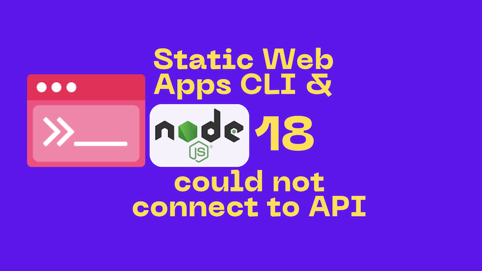

I make use of Azure Static Web Apps a lot. I recently upgraded to Node.js 18 and found that the Static Web Apps CLI no longer worked when trying to run locally; the API would not connect when running `swa start`:

`[swa] ❌ Could not connect to "http://localhost:7071/". Is the server up and running?`

This post shares a workaround. This works for v1.1.3 or earlier of the Static Web Apps CLI. If you're using v1.1.4 or later, you should not need this workaround. But in that case [you might find this post helpful on improving performance with 1.1.4 or later](../2024-06-18-static-web-apps-cli-improve-performance-with-vite-server-proxy/index.md).



<!--truncate-->

With Node.js 17 onwards there were changes in the behaviour of Node.js concerning DNS names. Although it's not obvious, the [changes happened here](https://github.com/nodejs/node/pull/39987) and the result of this was that IPv6 became the default DNS instead of IPv4. You can read more about this [on this GitHub issue](https://github.com/nodejs/node/issues/40537).

## How this affects the Static Web Apps CLI

My own setup is a Vite front end and a Function App back end. I have a `package.json` in the folder of the front end app with the following scripts:

```json
"dev": "vite",
"start": "swa start http://localhost:5173 --run \"npm run dev\" --api-location ../FunctionApp"
```

I could see both front end and back end starting up in the console, but inevitably the SWA CLI would report:

`[swa] ❌ Could not connect to "http://localhost:7071/". Is the server up and running?`

I experienced this when moving from Node.js 16 to Node.js 18. A dependency of the Static Web Apps CLI; the [wait-on](https://github.com/jeffbski/wait-on) library which waits for endpoints to become available, was impacted by the new behavior. [With Node.js 18 this is broken](https://github.com/jeffbski/wait-on/issues/137).

A fix to the overall issue was released in [v1.1.4 of the Static Web Apps CLI](https://github.com/Azure/static-web-apps-cli/releases/tag/v1.1.4). Unfortunately, it caused performance issues with the proxy server. [This post shows you how to work around this issue](../2024-06-18-static-web-apps-cli-improve-performance-with-vite-server-proxy/index.md). If you'd like to work around the issue with v1.1.3 or earlier, read on.

## The workaround for v1.1.3 or earlier

Various workarounds are suggested in [this GitHub issue](https://github.com/Azure/static-web-apps-cli/issues/663). I shared my own there, and I'm sharing it here too. (Mostly for me, I'll lay money I need this again and again.)

In the root of my project I installed [concurrently](https://www.npmjs.com/package/concurrently):

```
npm i concurrently
```

Then, again in the root of my project I added the following scripts:

```json
"debug": "concurrently -n \"staticwebapp,functionapp\" -c \"bgBlue.bold,bgMagenta.bold\" \"npm run debug:staticwebapp\" \"npm run debug:functionapp\"",
"debug:staticwebapp": "cd src/StaticWebApp && npm run debug",
"debug:functionapp": "cd src/FunctionApp && func start",
```

What's happening here is that I'm running the Static Web Apps CLI and the Function App CLI in separate processes, and running them concurrently when we run `npm run debug`. You'll note that the `debug:staticwebapp` script is running another `debug` script with the Static Web Apps CLI in the `src/StaticWebApp` folder:

```json
"debug": "swa start http://localhost:5173 --run \"npm run dev\" --api-location http://127.0.0.1:7071",
```

The `--api-location` flag is pointing to the endpoint the Function App is surfaced at. This is the key to the workaround.

## Summary

This takes us back to having a setup that will work with Node.js 18. Hopefully this is only needed for a short while, but it's good to have a workaround in the meantime.
